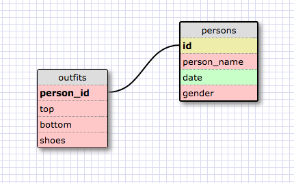

###SQL Queries###
1. SELECT * FROM states;
2. SELECT * FROM regions;
3. SELECT state_name, population FROM states;
4. SELECT state_name, population FROM states ORDER BY population DESC;
5. SELECT state_name FROM states WHERE region_id = 7;
6. SELECT state_name, population_density FROM states WHERE population_density > 50 ORDER BY population_density ASC;
7. SELECT state_name FROM states WHERE population BETWEEN 1000000.00 and 1500000.00;
8. SELECT state_name, region_id FROM states ORDER BY region_id ASC;
9. SELECT region_name FROM regions WHERE region_name LIKE "%Central%";
10. SELECT region_name, state_name FROM states LEFT JOIN regions ON states.region_id = regions.id ORDER BY region_id ASC;

###Reflection:###
What are databases for?
Databases are a way to organize large amounts of data. Using tablesand columns, data is organized into specific categories so it can be more easily accessed.
What is a one-to-many relationship?
When fundamentally different things have a relationship, and that relationship can be categorized as follows: A belongs to a B, B has many things of type A. Basically, something belongs to a larger category, that also is the category containing many other items other than that original thing.
What is a primary key? What is a foreign key? How can you determine which is which?
A primary key is unique for each record in the table. There is always only ONE primary key per relational database. The foreign key is the attribute in one table that is used to connect to the other table - the place where it connects to the other table is the primary key. The foreign key uniquely identifies a row of another table. It is defined in a second table, but refers to the primary key in the first table. The table with the foreign key is the child table, and the table with the primary key is the parent table.
How can you select information out of a SQL database? What are some general guidelines for that?
The general query is: SELECT something FROM table_name; (don't forget one semicolon at the end of the query!). The things you select are generally column names, or attributes of a specific table and you specify what table you want that coming from. There are ways to specify exactly what information you want: you can use WHERE to specify values you want to return, or ORDER BY to order the data in ASC (ascending) or DESC (descending) order when displayed.

###My Outfit Picking Schema###
