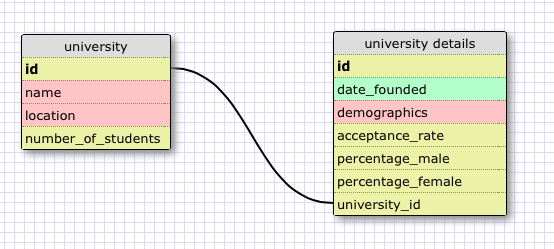

###One-to-One Schema###

This is a one-to-one relationship because the details table expands on details that are relevant only to one university. Each university has only one date it was founded on, one demographic composition, and one percentage for female/male population. These details are specific to that one university and cannot be applied to any other university. The parent table (university) is the table that has the most useful information that will be referred to in most queries, but if additional information is needed, it can be accessed from the child table. This makes queries more efficient, so they don't have to search through a table with a ton of fields that aren't used most of the time.

###Grocery List Schema###

###Reflection###
#####What is a one-to-one database?#####
A one-to-one database is a collection of data that has a single relationship to one another. The two are a pair and belong only to each other. This means that table one can only be related to table two, and table two is only related to table one.

#####When would you use a one-to-one database?#####
One-to-one databases are used if you need to expand upon a category and add more details that are specific to that category. The parent table would have the basic details about the item that are queried most often, and the child table would have additional details that are relevant, but not accessed as often. This makes querying more efficient since it won't have to search through many fields every time it searches the parent table, and will be only pointed toward the child table if necessary.

#####What is a many-to-many database?#####
A many-to-many database is a collection of data that has a relationship to each other, but is not singular. Table a item can belong to many of table b item, and table b item can belong to many of table a item. They usually include a join table that joins the ids of the two tables in one table.

#####When would you use a many-to-many database?#####
You'd use a many-to-many database if you had two categories you wanted to join in one, yet have multiple options for both categories that are interchangeable. It is a way to pair one instance of each table together.

#####What is confusing about database schemas? What makes sense?#####
Thinking through what is truly a one-to-one relationship took some time because I'd initially think something was a singular relationship, then realize it was actually one-to-many. For my university example above, I was thinking it would be one-to-one comparing student to university attended because one student goes to one university. Upon thinking about it I realized one university takes many other students - this would be one-to-many.